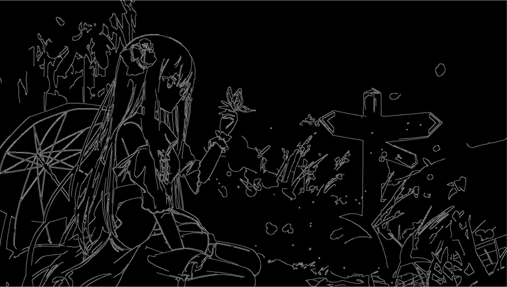
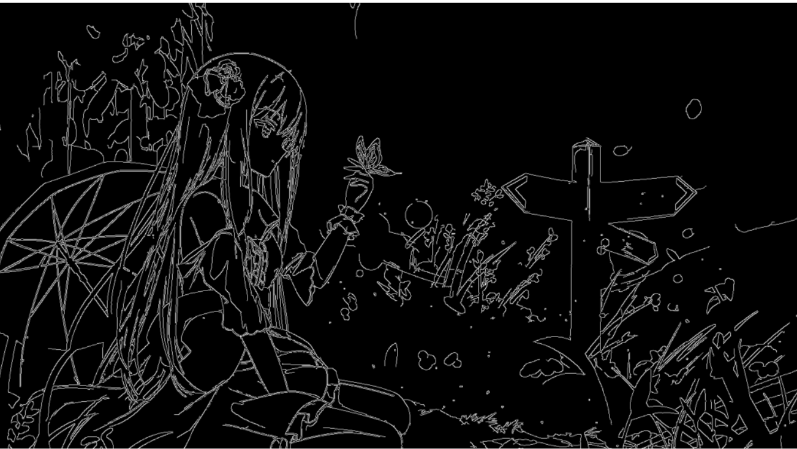
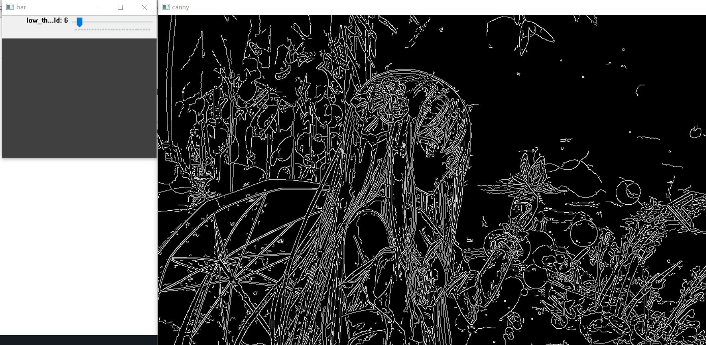
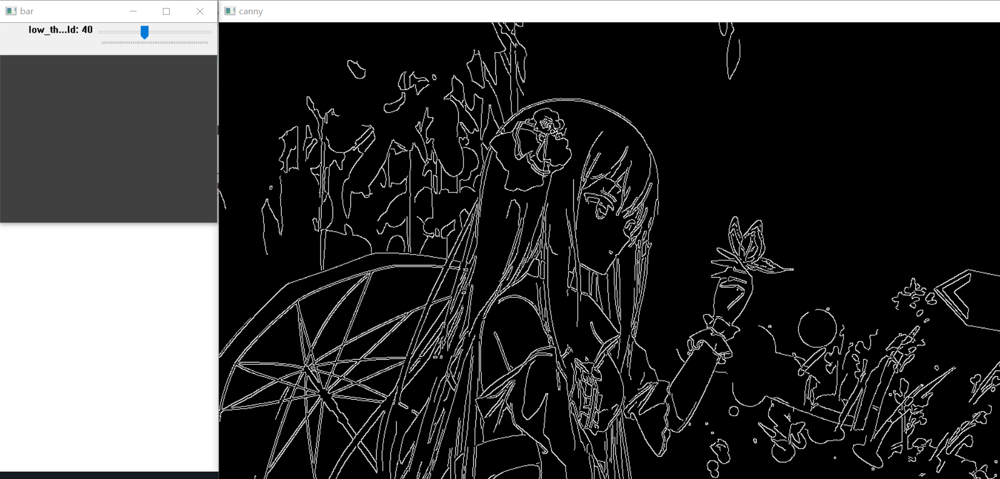
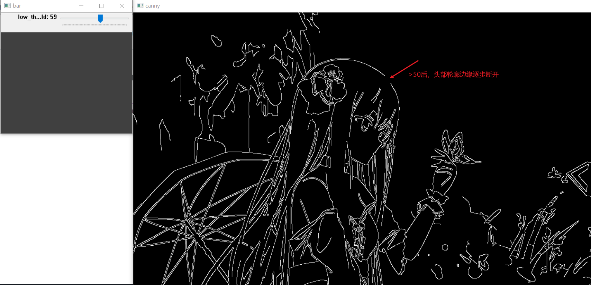

# 提升边缘检测质量

## 输入视频质量

尽可能保证输入视频的码率和清晰度比较高。

## 高斯模糊预处理

| 有高斯模糊预处理 (ksize=(3, 3),sigmaX=0)| 无高斯模糊预处理 |
|---|---|
|||
| 边缘线条噪点明显减少 | 边缘线条含有较多噪点 |

高斯核滤波器的大小是一个关键的参数。

- 较小的滤波器产生的模糊效果较少，这样可以检测较小、变化明显的细线。
- 较大的滤波器产生的模糊效果较多，将较大的一块图像区域涂成一个特定点的颜色值。结果对于检测较大、平滑的边缘更加有用，例如彩虹的边缘。

## 双阈值参数优化

条件：

- 高阈值一般为低阈值的 2 倍或者 3 倍，这里取 3 倍。确定低阈值后，就能确定高阈值。
- 低阈值过低则会产生大量不需要的边缘噪点，过高会丢失重要的边缘。因此，需要一个合理的低阈值参数。
- 对于不同的处理输入，存在不同的合理低阈值。

** 目前还没有一个经过验证的实现方法。**

根据这篇文章 [^3]，使用滑动条来可视化确定低阈值参数的合理范围。

| 过低 | 合理 | 过高 |
|---|---|---|
||||

- 对于上面的例子插图，得到的合理低阈值范围大约为 [40,50]。
- 对应魔女之旅 OP，得到的合理低阈值范围大约为 [15,40] 。 一个需要权衡的选择：
    - [ ] low_thresh太小，例如16，那么画面有时会很脏，字体周围存在大量噪点，以及捕获了大量边缘细节。
    - [x] low_thresh适中时，例如30，此时字体周围比较干净，然而有些帧开始丢失一些重要的人物细节，例如人物边缘断开大部分。

总结：对于固定low_thresh而言，无法普遍做到每个帧都很完美地提取，有些帧提取地很好，有些提取地没那么好。请考虑otsu自适应阈值法。
目前做法：保证字体清晰度，向丢失部分人物边缘妥协，不将画面弄脏。

## 边缘线条的宽度

在使用高斯核 (3,3) 以及 canny low_thresh=30, high_threshod=90 的情况下，线条边缘比较锐利、细。

如果可以加粗最终检测出来的边缘线条，那么观感会更加好。

实现了 dilation 效果，但是对于较小的字体，会发生拥挤的视觉效果，会产生视觉疲劳，因此在魔女之旅中仅使用(2,2)的膨胀核。
> 当使用(3,3)的膨胀核时，字幕字体几乎很难看清。

下面是使用(2,2)的膨胀核后处理的截图效果：

## 视频质量的关键：降噪

视频质量一方面取决于提取边缘是否准确清晰（加分点），一方面取决于画面其他地方噪点数量（扣分点）。

## references

- [^1]：[用 opencv 和 moviepy 实现视频边缘检测](https://blog.csdn.net/caocry/article/details/125302452)
- [^2]：[scatter-animation-for-ikun](https://github.com/GBL-123/scatter-animation-for-ikun)
- [^3]：[Canny 边缘提取相关知识学习，图像处理第 32 篇博客](https://xie.infoq.cn/article/6c56d36eff240a817842d9067)
- [^4]：[Canny_edge_detector](https://en.wikipedia.org/wiki/Canny_edge_detector)