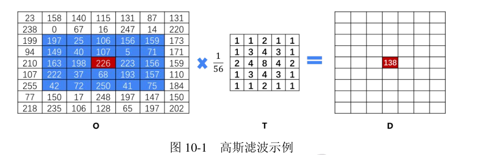
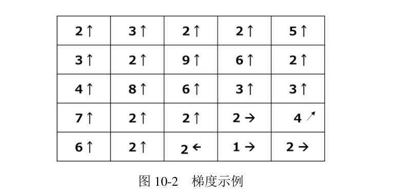

# 《OpenCV 轻松入门》笔记

> 注意：这个文章和该项目没有直接的内容关联。

## 第一章：opencv 入门

快速略读。

## 第二章：图像处理基础

- 二值图像的数据表示。 矩阵的每个点是 0 或者 1。当然也可以使用 8 位来表示二值图像。此时白色为 255，黑色为 0。没有中间值。
- 8 位的灰阶图像。矩阵的每个点都是位于 [0,255] 之间的任意整数值。
- 1600 万色的由来。 256×256×256=16 777 216。
- 可以使用 image[0,0] 访问图像 image 第 0 行第 0 列位置上的像素点。这个点就是 (R,G,B) 形式，含有 3 个通道。
- 可以使用 image[0,0,0] 访问图像 image 的第 0 行第 0 列上的像素点的 B 通道的值。因此 opencv 默认是 BGR 模式。
- 使用 numpy.array 访问像素，例如 img.item(3, 2) 和 img.itemset((3, 2), 255) 比原生方式的使用下标逐个处理像素高效。
- 我们可能会对图像的某一个特定区域感兴趣，该区域被称为感兴趣区 域（Region of Interest，ROI）。格式：`a=img[200:400,200:400]`

```
a=img[200:400,200:400]
img[200:400,600:800]=a
```

- 图片通道拆分：按索引拆分例如 `b = img[: , : , 0]` ；通过函数拆分，例如 `b,g,r=cv2.split(img)`。
- 图片通道合并：`bgr = cv2.merge([b, g, r])`

小结：获取像素和打印像素，以及更换特定位置的像素值。

## 第三章：图像运算

- 加法运算：
    - img1 + img2：对于 a+b，如果 a+b<=255，那么结果为 a+b；否则，取 wrap around，也就是 (a+b) mod 256。
    - 使用 cv2.add() 函数。对于 a+b，如果 a+b<=255，那么结果为 a+b；否则，取饱和值（上界），也就是 255。
- 图像加权和：dst = saturate(src1 × α + src2 × β + γ)。结果图像 = 图像 1×系数 1+ 图像 2×系数 2+ 亮度调节量。
- 按位逻辑运算。OR AND XOR NOT
- 可以将掩模图像转换为 BGR 模式的彩色图像，让彩色图像与掩模图像进行按位与操作，实现掩模运算。
- cv2.imread()flags
  参阅 [imgcodecs.hpp](https://github.com/opencv/opencv/blob/master/modules/imgcodecs/include/opencv2/imgcodecs.hpp)
- 位平面分解：

```
value = a7 × 27 + a6 × 26 + a5 × 25 + a4 × 24 + a3 × 23 + a2 × 22 + a1 × 21 + a0 × 20
```

例如，8bit 图像可以分解为 8 个位平面，分别是 a0,a1,...,a7。其中 a7 权重最大。 将像素值与一个值为 2n 的数值进行按位与运算，能够使像素值的第 n 位保持不变，而将其余各位均置零。根据这个原理来提取特定的位。

- 图像加密和解密：a 和 b 异或得到 c，c 和 b 再次异或可以还原 a。
    - 加密过程：将明文 a 与密钥 b 进行按位异或，完成加密，得到密文 c。
    - 解密过程：将密文 c 与密钥 b 进行按位异或，完成解密，得到明文 a。

## 第四章：色彩空间类型转换

- GRAY 色彩空间。
    - RGB -> GRAY 转化公式：Gray = 0.299 · R + 0.587 · G + 0.114 · B。 或者 (R+G+B)/3。
    - GRAY -> RGB 转化公式：G=GRAY；G=GRAY；B=GRAY。
- XYZ 色彩空间。
- YCrCb 色彩空间。Y 代表光源的亮度，色度信息保存在 Cr 和 Cb 中，其中，Cr 表示红色分量信息，Cb 表示蓝色分量信息。 关于 RGB <-> YCrCb 之间的转化可以参考 wiki。
- HSV 色彩空间。公式参见 opencv wiki。
- HLS 色彩空间。
- CIE LAB 色彩空间。
- CIE LUV 色彩空间。
- Bayer 色彩空间。通过色彩空间交换表来处理。
- 类型转换函数。cv2.cvtColor()。
- 标记指定颜色：通过 inRange 函数锁定特定值，通过基于掩码的按位与显示 ROI。
- 在实际提取颜色时，往往不是提取一个特定的值，而是提取一个颜色区间。 HSV 模式中 S 通道、V 通道的值的取值范围一般是 [100,255]。这主要是因为， 当饱和度和亮度太低时，计算出来的色调可能就不可靠了。
  根据上述分析，各种颜色的 HSV 区间值分布在 [H−10,100,100] 和 [H+10,255,255] 之间。

## 第五章：几何变换

（TODO：先跳过）

## 第六章：阈值处理

- 阈值处理是指剔除图像内像素值高于一定值或者低于一定值的像素点。例子，图像二值化。
- OpenCV 提供了函数 cv2.threshold()和函数 cv2.adaptiveThreshold()，用于实现阈值处理。
- cv2.threshold() 种类：
    - 二值化阈值处理（cv2.THRESH_BINARY）
    - 反二值化阈值处理（cv2.THRESH_BINARY_INV）
    - 截断阈值化处理（cv2.THRESH_TRUNC）
    - 超阈值零处理（cv2.THRESH_TOZERO_INV）
    - 低阈值零处理（cv2.THRESH_TOZERO）
- 适应式阈值处理：cv2.adaptiveThreshold()。
- Otsu 方法会遍历所有可能阈值，从而找到最佳的阈值。

```
t,otsu=cv2.threshold(img,0,255,cv2.THRESH_BINARY+cv2.THRESH_OTSU)
```

## 第七章：图像平滑处理

TODO READ

## 第 8 章 形态学操作

TODO READ

## 第九章 图像梯度

图像梯度计算的是图像变化的速度。对于图像的边缘部分，其灰度值变化较大，梯度值也 较大； 相反，对于图像中比较平滑的部分， 其灰度值变化较小，相应的梯度值也较小。一般情况下，图像梯度计算的是图像的边缘信息。

- 梯度算子：涉及3个像素点。当前点A，A的右边点，A的下边点。只关注水平和垂直方向的相邻点。线宽计算距离为1。
- Robert算子：涉及4个像素点。对象线方向，↖和↗方向。取 max{|ΔX|,|ΔY|}。这种方式没有梯度算子的开方运算，计算更简单。线宽计算距离为1。
- sobel 算子。涉及8个像素点。梯度值较大。先平滑再处理。|ΔX|+|ΔY|。线宽计算距离为2。
- Laplacian 算子。4领域和8领域两种模版。
- Scharr 算子。
- 沈俊算子。参数a0。

TODO READ。

## 第十章 canny 边缘检测。

Canny 边缘检测分为如下几个步骤。

- 步骤 1：去噪。噪声会影响边缘检测的准确性，因此首先要将噪声过滤掉。
- 步骤 2：计算梯度的幅度与方向。
- 步骤 3：非极大值抑制，即适当地让边缘“变瘦”。
- 步骤 4：确定边缘。使用双阈值算法确定最终的边缘信息。

1. 高斯滤波器。
   

```
结果 =
1/56×(197×1+25×1+106×2+156×1+159×1
+149×1+40×3+107×4+5×3+71×1
+163×2+198×4+226×8+223×4+156×2
+222×1+37×3+68×4+193×3+157×1
+42×1+72×1+250×2+41×1+75×1)
= 138
```

高斯滤波器（高斯核）不是固定的。通常来说，一个 5×5 的核能够满足大多数的情况。

2. 计算梯度
   

梯度的方向总是与边缘垂直的，通常就近取值为水平（左、右）、垂直（上、下）、对角线 （右上、左上、左下、右下）等 8 个不同的方向。

3. 非极大值抑制 在获得了梯度的幅度和方向后，遍历图像中的像素点，去除所有非边缘的点。在具体实现 时，逐一遍历像素点，判断当前像素点是否是周围像素点中具有相同梯度方向的最大值， 并根据判断结果决定是否抑制该点。

该步骤是边缘细化的过程。针对每一个像素点：

- 如果该点是正 / 负梯度方向上的局部最大值，则保留该点。
- 如果不是，则抑制该点（归零）。

4. 应用双阈值确定边缘 完成上述步骤后，图像内的强边缘已经在当前获取的边缘图像内。但是，一些虚边缘可能 也在边缘图像内。这些虚边缘可能是真实图像产生的，也可能是由于噪声所产生的。对于后者， 必须将其剔除。

canny 函数的应用：

```
edges = cv.Canny(image, threshold1, threshold2[, apertureSize[, L2gradient]])
```

- apertureSize 表示 Sobel 算子的孔径大小。
- L2gradient 为计算图像梯度幅度（gradient magnitude）的标识。其默认值为 False。如果 为 True，则使用更精确的 L2 范数进行计算（即两个方向的导数的平方和再开方），否 则使用 L1
  范数（直接将两个方向导数的绝对值相加）。

## 第 11 章 图像金字塔

TODO READ

## 第 18 章 视频处理

没什么值得注意的内容。